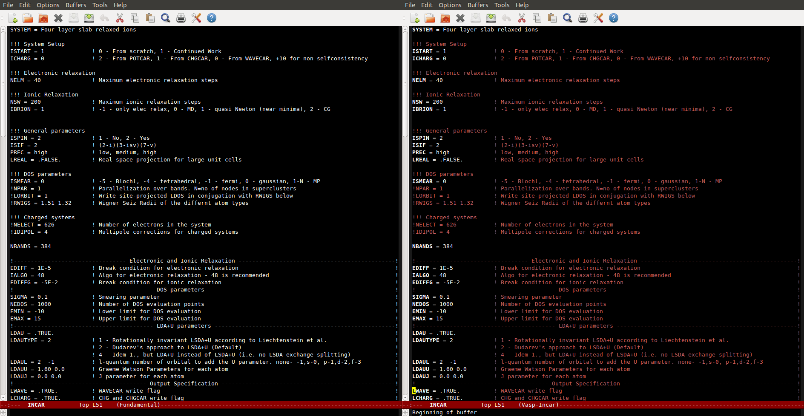

emacs-incar-mode
================

An emacs major mode for working with INCAR input files for the [VASP](https://www.vasp.at/) package. I use it prevent any typos or unintended commenting of input tags in the INCAR file. Best when used with a good color theme like [this](https://github.com/bbatsov/solarized-emacs)

Usage
=====
Clone the repo and copy the contents of `vasp-incar.el` into your `~/.emacs.el` file

Result
======
When combined with a good color theme, incar-mode helps identify commenting and typos easily

To do
=====

* Update keyword list for VASP 5.4
* Add descriptions of all allowed keywords from the VASP wiki and enable autocomplete
